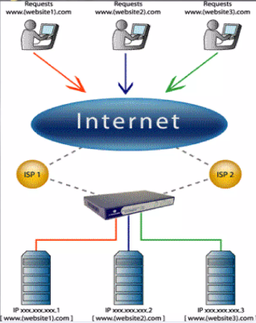
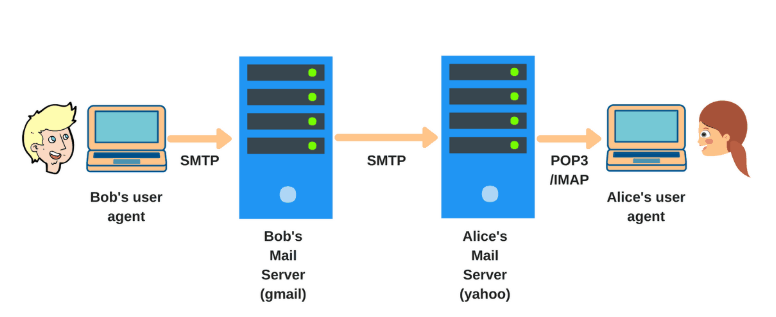

# DNS dan SMTP
# DNS
DNS (Domain Name System) adalah sistem yang digunakan untuk menerjemahkan nama domain yang mudah diingat (seperti www.example.com) menjadi alamat IP yang diperlukan untuk mengidentifikasi dan menghubungkan perangkat di jaringan, seperti komputer atau server. DNS berfungsi seperti "buku telepon" internet, yang memungkinkan pengguna untuk mengakses situs web menggunakan nama domain alih-alih harus mengingat alamat IP yang kompleks.

### Fungsi DNS
1. Resolusi Nama: DNS mengubah nama domain (misalnya google.com) menjadi alamat IP (misalnya 172.217.10.46) yang digunakan oleh perangkat untuk saling berkomunikasi di jaringan.
2. Mempermudah Pengguna: Tanpa DNS, kita harus mengakses situs dengan menggunakan alamat IP, yang jauh lebih sulit diingat dibandingkan nama domain.
3. Distribusi Beban dan Keandalan: DNS juga memungkinkan distribusi beban trafik dengan mendukung beberapa server untuk satu nama domain (misalnya, load balancing), serta memberikan redundansi dan keandalan.

### Cara Kerja DNS
1. Permintaan DNS (DNS Query): Ketika pengguna mengetikkan alamat web seperti www.example.com, browser mengirimkan permintaan DNS untuk mencari tahu alamat IP yang sesuai.
2. Resolver DNS: Permintaan ini pertama kali diterima oleh resolver DNS (biasanya disediakan oleh penyedia layanan internet atau ISP). Resolver ini akan mencari informasi terkait alamat IP yang sesuai dengan nama domain.
3. Cache DNS: Resolver DNS akan memeriksa cache-nya terlebih dahulu untuk melihat apakah sudah ada informasi yang disimpan. Jika ada, resolver akan mengembalikannya tanpa perlu melakukan pencarian lebih lanjut.
4. Root DNS Server: Jika informasi tidak ditemukan di cache, resolver akan meminta informasi dari server root DNS, yang akan memberikan petunjuk tentang server DNS yang lebih spesifik untuk menangani domain tertentu.
5. Authoritative DNS Server: Server DNS otoritatif untuk domain yang diminta akan memberikan jawaban berupa alamat IP yang terkait dengan nama domain.
6. Pengembalian Informasi: Setelah alamat IP ditemukan, resolver DNS mengirimkan informasi tersebut kembali ke browser, yang kemudian menghubungi server tujuan menggunakan alamat IP yang diperoleh.

#### Contoh DNS
  
Gambar tersebut menggambarkan proses dasar bagaimana DNS (Domain Name System) bekerja dalam menghubungkan pengguna dengan situs web.
#### Berikut penjelasan:
1. Pengguna Meminta Situs Web:  
- Pengguna mengetikkan alamat situs web (misalnya, [URL yang tidak valid dihapus]) pada browser mereka.
- Browser kemudian mengirimkan permintaan ini ke Internet.

2. Permintaan Mencapai ISP (Internet Service Provider):

- Permintaan tersebut akan melewati ISP (penyedia layanan internet) pengguna.
- ISP memiliki server DNS sendiri yang akan memproses permintaan ini.

3. DNS Server Mencari Alamat IP:

- Server DNS akan memeriksa cache-nya (tempat penyimpanan sementara) untuk melihat apakah sudah memiliki alamat IP yang sesuai dengan nama domain yang diminta.
- Jika ditemukan, alamat IP akan langsung dikirimkan ke browser.
- Jika tidak ditemukan di cache, server DNS akan melakukan query ke server DNS lain yang lebih tinggi tingkatannya (seperti root server, TLD server, atau authoritative server) hingga menemukan alamat IP yang benar.

4. Alamat IP Ditemukan dan Dikirim:

- Setelah alamat IP ditemukan, server DNS akan mengirimkan alamat IP tersebut kembali ke browser pengguna.

5. Browser Mengakses Situs Web:

- Browser kemudian menggunakan alamat IP yang telah diperoleh untuk menghubungkan ke server web yang sesuai.
- Server web akan mengirimkan konten situs web (halaman, gambar, dll.) ke browser pengguna.
- Browser lalu menampilkan konten tersebut di layar pengguna.

### Komponen DNS:
1. Domain Name: Nama domain yang ingin diakses, seperti google.com.
2. DNS Records: Data yang disimpan dalam server DNS, termasuk berbagai jenis catatan seperti:
- A Record: Menyimpan alamat IPv4 untuk nama domain.
- AAAA Record: Menyimpan alamat IPv6.
- CNAME Record: Menyediakan alias untuk domain lain.
- MX Record: Menyimpan informasi server email untuk domain.
3. DNS Resolver: Perangkat atau aplikasi yang mengirimkan permintaan ke server DNS untuk menemukan alamat IP dari nama domain.
4. DNS Server: Server yang menyimpan catatan DNS dan menangani permintaan untuk mengubah nama domain menjadi alamat IP.

#### Secara umum, DNS adalah bagian penting dalam infrastruktur internet yang memungkinkan pengguna mengakses situs web dan layanan lain di internet dengan mudah menggunakan nama domain yang lebih manusiawi, bukan dengan alamat IP numerik.

# SMTP
SMTP (Simple Mail Transfer Protocol) adalah protokol yang digunakan untuk mengirimkan email antara server dan klien di jaringan. SMTP merupakan protokol standar untuk pengiriman email, yang berfungsi untuk mentransfer pesan dari satu server ke server lainnya melalui jaringan internet.

## Fungsi SMTP
1. **Pengiriman Email**: SMTP digunakan untuk mengirimkan email dari email client (misalnya Outlook, Thunderbird) ke server email, atau dari satu server email ke server email lainnya.
2. **Routing Pesan**: SMTP juga bertanggung jawab untuk menentukan jalur pengiriman email ke penerima berdasarkan alamat email tujuan.
3. **Menyambungkan ke Server Penerima**: Ketika email dikirim, SMTP menghubungkan dengan server email penerima untuk menyampaikan pesan.

## Cara Kerja SMTP
1. **Pembuatan Pesan Email**: Pengguna menulis email menggunakan email client (seperti Gmail, Outlook, dll) dan menekan tombol kirim.
2. **Koneksi ke Server SMTP**: Email client menghubungi server SMTP yang disediakan oleh penyedia layanan email (misalnya, server Gmail atau Outlook).
3. **Proses Pengiriman**: Server SMTP memeriksa alamat tujuan dan mencari tahu server tujuan yang tepat menggunakan DNS (Domain Name System). Setelah menemukan server penerima, SMTP mengirimkan pesan ke server email tujuan.
4. **Pengiriman ke Mail Server Penerima**: Server penerima (misalnya, server email penerima yang menggunakan Gmail atau Yahoo) menerima email dan menyimpannya.
5. **Pengambilan Pesan oleh Penerima**: Penerima kemudian menggunakan protokol seperti POP3 (Post Office Protocol) atau IMAP (Internet Message Access Protocol) untuk mengunduh atau mengakses email dari server penerima.

  

### Proses Kerja SMTP Secara Ringkas:
1.Pengguna menulis email dan menekan tombol kirim.  
2. Email client menghubungi server SMTP untuk mengirimkan email.  
3. Server SMTP memverifikasi alamat email penerima menggunakan DNS.  
4. Email dikirim melalui jaringan ke server penerima.  
5. Server penerima menyimpan email untuk penerima.  
6. Penerima mengambil email menggunakan POP3 atau IMAP.  

## Protokol yang Terkait dengan SMTP:
1. **POP3** (Post Office Protocol): Digunakan untuk mengunduh email dari server ke perangkat penerima. Setelah diunduh, email akan dihapus dari server. 
2. **IMAP** (Internet Message Access Protocol): Digunakan untuk mengakses email dari server tanpa mengunduhnya secara permanen. IMAP memungkinkan pengguna untuk mengakses email dari beberapa perangkat dan menyinkronkan status email (dibaca, belum dibaca, dll).
3. **MIME** (Multipurpose Internet Mail Extensions): Digunakan bersama dengan SMTP untuk mengirimkan email yang berisi lampiran atau format non-teks (misalnya gambar, audio, atau video).

## Kelemahan SMTP:
1. **Tidak Ada Enkripsi Bawaan**: SMTP tidak menyediakan enkripsi untuk pesan secara default, yang bisa berisiko jika email berisi informasi sensitif. Namun, enkripsi bisa ditambahkan melalui TLS/SSL.
2. **Tidak Dirancang untuk Penyimpanan Pesan**: SMTP hanya digunakan untuk mengirim email, bukan untuk menyimpan atau mengakses email. Itu sebabnya dibutuhkan protokol lain seperti POP3 atau IMAP untuk mengakses dan mengelola pesan.

## Contoh Penggunaan SMTP:
1. **Pengiriman Email**: Ketika Anda mengirim email menggunakan Gmail, server Gmail menggunakan SMTP untuk mengirim email tersebut ke server email penerima.
2. **Penyediaan Layanan Email oleh Penyedia Hosting**: Banyak layanan hosting email (misalnya, layanan hosting bisnis) menyediakan akses ke server SMTP untuk memungkinkan pengiriman email yang lebih handal.

#### Secara keseluruhan, SMTP adalah protokol yang esensial untuk komunikasi email di internet, memungkinkan pesan dikirim dengan cara yang terstruktur dan terorganisir.
