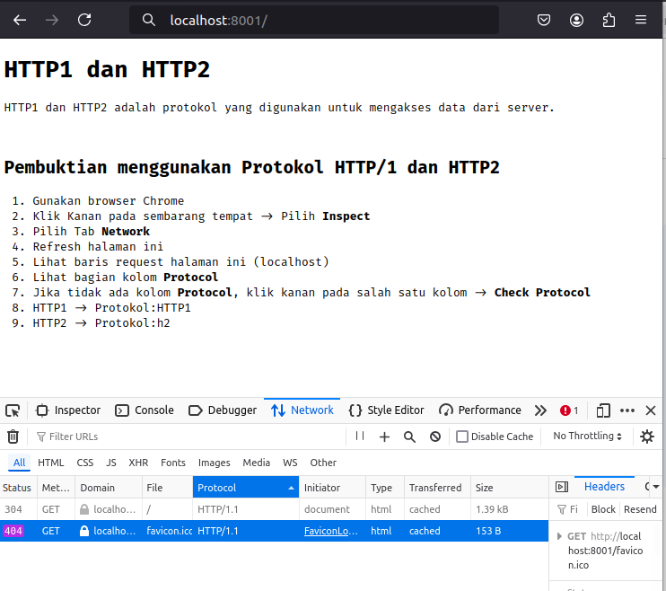
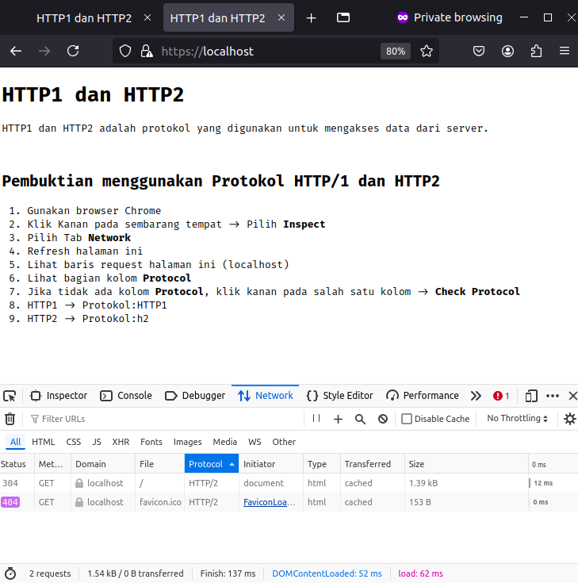

# Membuat HTTP1 dan HTTP2 Menggunakan Docker

### Docker
1. Kunjungi situs resmi [Docker] (https://www.docker.com/) dan pilih versi yang sesuai dengan sistem operasi (Windows, macOS, atau Linux).

2. Ikuti petunjuk instalasi sesuai dengan sistem operasi yang digunakan.
3. Instalasi Docker Compose.
- Docker Compose memungkinkan untuk mengatur multi-container aplikasi.

### Instalasi OpenSSL
1. Pastikan `openssl` sudah terinstall
2. Jika belum, silakan install sesuai dengan OS pada local machine

### Membuat Workspace
1. Buat folder project dan masuk ke dalam direktori folder project yang sudah dibuat
2. Buat folder `nginx-config` dan `ssl`

## Project

### 1. Nginx Configuration
1. Masuk ke folder `{folder_workspace}/nginx-config`
2. Buat file `default.conf`
3. Masukkan kode berikut:
```nginx
server {
  # HTTP/1.1 listen on port 80
  listen 80;

  # HTTP/2 listen on port 443 for SSL
  listen 443 ssl;
  http2 on;

  # OpenSSL
  ssl_certificate /etc/nginx/certs/server.crt;
  ssl_certificate_key /etc/nginx/certs/server.key;
  ssl_protocols TLSv1.3;
  ssl_prefer_server_ciphers off;

  # Security headers
  add_header X-Content-Type-Options nosniff;

  # Root directory of website on linux os
  root /var/www/;
  index index.html;
}
```
4. Save

### 2. Landing Page
1. Buat file pada workspace `index.html`
2. Masukkan code berikut:
```html
<!DOCTYPE html>
<html lang="en">

<head>
    <meta charset="UTF-8">
    <meta name="viewport" content="width=device-width, initial-scale=1.0">
    <title>HTTP1 dan HTTP2</title>
    <link rel="preconnect" href="https://fonts.googleapis.com">
    <link rel="preconnect" href="https://fonts.gstatic.com" crossorigin>
    <link href="https://fonts.googleapis.com/css2?family=Fira+Code:wght@300..700&family=Roboto+Slab:wght@100..900&display=swap" rel="stylesheet">
    <style>
        body {
            font-family: 'Fira Code', 'Arial Narrow', Arial, sans-serif, sans-serif;
        }
    </style>
</head>

<body>
    <h1>HTTP1 dan HTTP2</h1>
    <p>HTTP1 dan HTTP2 adalah protokol yang digunakan untuk mengakses data dari server.</p>
    <br>
    <h2>Pembuktian menggunakan Protokol HTTP/1 dan HTTP2</h2>
    <ol>
        <li>Gunakan browser Chrome</li>
        <li>Klik Kanan pada sembarang tempat -> Pilih <strong>Inspect</strong></li>
        <li>Pilih Tab <strong>Network</strong></li>
        <li>Refresh halaman ini</li>
        <li>Lihat baris request halaman ini (localhost)</li>
        <li>Lihat bagian kolom <strong>Protocol</strong></li>
        <li>Jika tidak ada kolom <strong>Protocol</strong>, klik kanan pada salah satu kolom -> <strong>Check Protocol</strong></li>
        <li>HTTP1 -> Protokol:HTTP1</li>
        <li>HTTP2 -> Protokol:h2</li>
    </ol>
</body>

</html>
```

### 3. Docker Compose
1. Buat file pada workspace `docker-compose.yml`
2. Masukkan kode berikut:
```docker
version: '3.8'
services:
  web:
    image: nginx:alpine
    ports:
      - "8001:80" # HTTP/1.1
      - "443:443" # HTTP/2
    volumes:
      - ./nginx-config:/etc/nginx/conf.d
      - ./ssl:/etc/nginx/certs
      - ./index.html:/var/www/index.html
```
3. Save

## Test

1. Buka terminal
2. Masuk direktory `{folder_workspace}/`
3. Jalankan command berikut 
  ```bash
   sudo docker-compose up
   ```
4. Buka browser Chrome, akses localhost pada port 8001 [localhost:8001](http://localhost:8001) untuk Protokol HTTP/1

5. Buka browser Chrome, Akses https://localhost untuk Protokol HTTP/2

