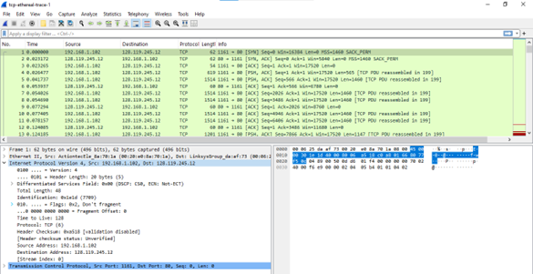
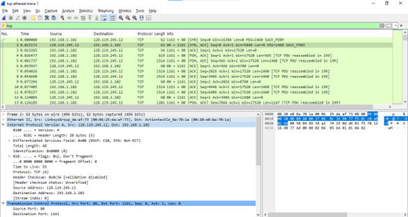
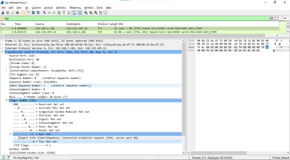
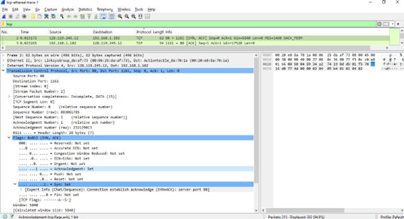
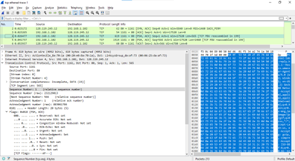
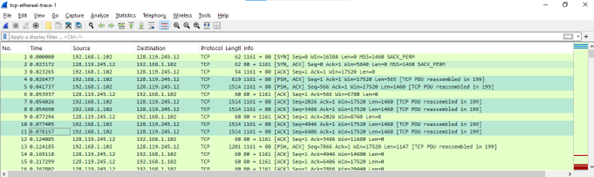
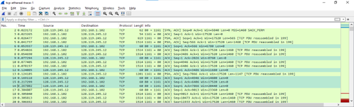
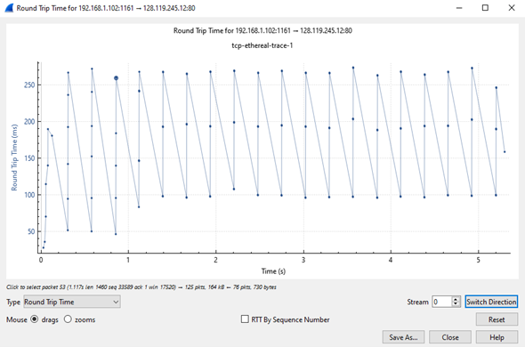
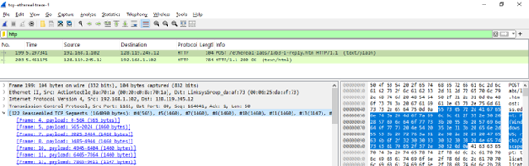

## Question  below are based on the trace file tcp-ethereal-trace-1 in in http://gaia.cs.umass.edu/wireshark-labs/wireshark-traces.zip.

### Answer the following questions for the TCP segments:
1.	What is the IP address and TCP port number used by your client computer (source) to transfer the file to gaia.cs.umass.edu? 
#### Answers:
  
Based on the figure above, the IP address of the client is 192.168.1.102, which is used to communicate within the local network. The TCP port number used is 1161, which allows access to certain applications or services on the system, facilitating data exchange between the client computer and the relevant server.
 
 
Video penjelasan:  

2.	What does gaia.cs.umass.edu use the IP address and port number to receive the file. (Attach the screenshot of your Wireshark's display) 
#### Answers:
  
IP address: 128.119.245.12, TCP port number: 80, is network information used to connect an application or service with a specific server via the HTTP protocol.

3.	What is the sequence number of the TCP SYN segment that is used to initiate the TCP connection between the client computer and gaia.cs.umass.edu? What is it in the segment that identifies the segment as a SYN segment? (Attach the screenshot of your Wireshark's display)
#### Answers:
  
The TCP SYN segment, with a sequence number of 0, initiates the TCP connection between the client computer and gaia.cs.umass.edu; the SYN flag in the Flags section is set to 1, indicating that this segment is a SYN segment used for connection establishment.

4.	What is the sequence number of the SYNACK segment sent by gaia.cs.umass.edu to the client computer in reply to the SYN? What is the value of the ACKnowledgement field in the SYNACK segment? How did gaia.cs.umass.edu determine that value? What is it in the segment that identifies the segment as a SYNACK segment? (Attach the screenshot of your Wireshark's display)
#### Answers:

Answers: client computer in response to the SYN is 0 in this trace. The ACKnowledgement field value in the SYNACK segment is 1, determined by adding 1 to the initial sequence number of the SYN segment from the client (the SYN segment's sequence number is 0). The SYN and Acknowledgement flags are set to 1, indicating that this segment is a SYNACK segment used to initialize the connection.

5.	What is the sequence number of the TCP segment containing the HTTP POST command? Note that in order to find the POST command, you’ll need to dig into the packet content field at the bottom of the Wireshark window, looking for a segment with a “POST” within its DATA field.(Attach the screenshot of your Wireshark's display)
#### Answers: 
  
Based on the image, it explains that TCP segment number 4 contains the HTTP POST command, which is used to send data from the client to the server. The sequence number of this segment is 1, indicating that it is the first segment in the ongoing TCP communication or connection.

6.	Consider the TCP segment containing the HTTP POST as the first segment in the TCP connection. What are the sequence numbers of the first six TCP connection segments (including the HTTP POST segment)? At what time was each segment sent? When was the ACK for each segment received? Given the difference between when each TCP segment was sent, and when its acknowledgement was received, what is the RTT value for each of the six segments? What is the EstimatedRTT value (see page 237 in textbook) after the receipt of each ACK? Assume that the value of the EstimatedRTT is equal to the measured RTT for the first segment, and then is computed using the EstimatedRTT equation on page 237 for all subsequent segments.
- Note: Wireshark has a nice feature that allows you to plot the RTT for each of the TCP segments sent. Select a TCP segment in the “listing of captured packets” window that is being sent from the client to the gaia.cs.umass.edu server. Then select: Statistics->TCP Stream Graph->Round Trip Time Graph.
#### Answers:

  
The HTTP POST segment is treated as the first segment in this trace. Segments 1 through 6 in this trace are numbered 4, 5, 7, 8, 10, and 11. The ACKs for segments 1 to 6 are recorded as segments 6, 9, 12, 14, 15, and 16 in the same trace.

Segment 1 sequence number: 1 
Segment 2 sequence number: 566
Segment 3 sequence number: 2026
Segment 4 sequence number: 3486
Segment 5 sequence number: 4946
Segment 6 sequence number: 6406

Formula RTT = ACK received time - Sent time
| Segment    | Sent time  | ACK received time | RTT (seconds)   |
| ---------- | ---------- | ------------------| --------------- |
| Segment1   | 0.026477   | 0.053937          | 0.02746         |
| Segment2   | 0.041737   | 0.077294          | 0.035557        |
| Segment3   | 0.054026   | 0.124085          | 0.070059        |
| Segment4   | 0.054690   | 0.169118          | 0.11443         |
| Segment5   | 0.077405   | 0.217299          | 0.13989         |
| Segment6   | 0.078157   | 0.267802          | 0.18964         |

- EstimatedRTT = 0.875 * EstimatedRTT + 0.125 * SampleRTT 
EstimatedRTT after the receipt of the ACK of segment 1:
- EstimatedRTT = RTT for Segment 1 = 0.02746 
EstimatedRTT after the receipt of the ACK of segment 2:
- EstimatedRTT = 0.875 * 0.02746 + 0.125 * 0.035557 = 0.0285 
EstimatedRTT after the receipt of the ACK of segment 3:
- EstimatedRTT = 0.875 * 0.0285 + 0.125 * 0.070059 = 0.0337 
EstimatedRTT after the receipt of the ACK of segment 4:
- EstimatedRTT = 0.875 * 0.0337+ 0.125 * 0.11443 = 0.0438  
EstimatedRTT after the receipt of the ACK of segment 5: 
- EstimatedRTT = 0.875 * 0.0438 + 0.125 * 0.13989 = 0.0558 5  
EstimatedRTT after the receipt of the ACK of segment 6:
- EstimatedRTT = 0.875 * 0.0558 + 0.125 * 0.18964 = 0.0725  

### Round Trip Time Graph

7.	What is the length of each of the first six TCP segments?(Attach the screenshot of your Wireshark's display)
#### Answers:  
  
The first TCP segment, containing the HTTP POST command, is 565 bytes, smaller due to the inclusion of the TCP header. The next five segments are each 1460 bytes, in line with the agreed Maximum Segment Size (MSS). MSS ensures the segment size fits the network capacity, preventing fragmentation and improving data delivery efficiency.

